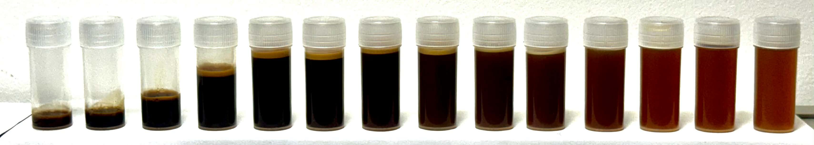

# Soft matter model of espresso brewing

<p align="center">
  
  <div align="center" style="font-style: italic;">Figure: espresso split into small batches.</div>
</p>

This repository accompanies a publication titled *title*.

# Usage

To run all scripts in the correct order

```bash
python3 main.py
```

Each script can be also run separately, with fitting scripts giving additional diagnostics. For example:
```bash
python3 fit_model_brewer_calibration.py
```

# License

This software is licensed under GPLv3 License
Copyright (C) Radost Waszkiewicz, Franciszek Myck, Łukasz Białas, Maria Puciata-Mroczyńska (2025).

# How to cite

```bibtex
@article{espresso,
	title        = {espresso},
	author       = {authors},
	year         = 2025,
	journal      = {arxiv},
	publisher    = {arxiv},
	volume       = vv,
	number       = nn,
	pages        = {pp}
}
```
